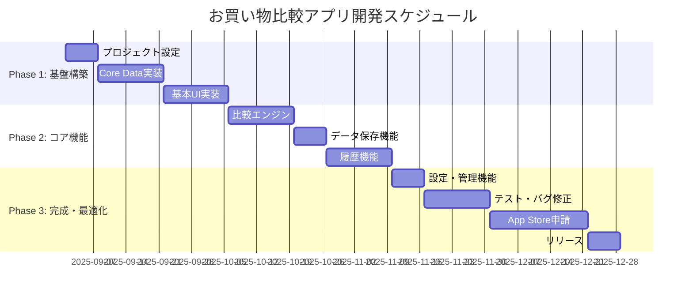

# お買い物比較アプリ - 開発スケジュール詳細計画

## 📅 プロジェクト期間概要

**全体期間**: 16週間（4ヶ月）  
**開始予定**: 2025年9月1日  
**リリース予定**: 2025年12月末  
**開発者**: 1名  

## 🎯 マイルストーン設定



## 📋 Phase 1: 基盤構築（Week 1-6）

### Week 1: プロジェクト設定・環境構築
**期間**: 9/1 - 9/7  
**工数**: 40時間  
**担当**: 開発者  

#### 具体的タスク
- [ ] **Xcodeプロジェクト作成** (4h)
  - SwiftUIプロジェクト初期化
  - Bundle Identifier設定
  - App Store Connect準備
  - Git repository設定

- [ ] **依存関係管理設定** (4h)
  - Swift Package Manager設定
  - 必要最小限のライブラリ選定
  - プロジェクト構成設計

- [ ] **アプリアーキテクチャ実装** (16h)
  - MVVM + Repository パターン実装
  - DI（Dependency Injection）設定
  - Error Handling基盤実装
  - Logger設定

- [ ] **Core Data初期設定** (8h)
  - .xcdatamodeld ファイル作成
  - NSPersistentContainer設定
  - 基本エンティティ定義
  - マイグレーション設定

- [ ] **UI基盤実装** (8h)
  - NavigationView構造実装
  - カスタムカラー・フォント定義
  - 基本コンポーネント作成
  - アクセシビリティ基盤

#### 成果物
- ✅ 動作するXcodeプロジェクト
- ✅ 基本的な画面遷移
- ✅ Core Data接続確認
- ✅ アーキテクチャ基盤

#### Week 1 完了基準
- [ ] アプリが起動し、基本画面が表示される
- [ ] Core Dataに簡単なデータを保存・取得できる
- [ ] Git commitが適切に行われている

---

### Week 2-3: Core Data実装
**期間**: 9/8 - 9/21  
**工数**: 80時間  
**担当**: 開発者  

#### Week 2: エンティティ・モデル実装 (40h)
- [ ] **ProductGroup エンティティ実装** (12h)
  - 基本プロパティ定義
  - 正規化機能実装
  - 統計情報計算ロジック
  - バリデーション実装

- [ ] **ProductRecord エンティティ実装** (12h)
  - 価格計算ロジック
  - 単価計算機能
  - 税込み処理
  - Unit enum実装

- [ ] **Category エンティティ実装** (8h)
  - システムカテゴリ生成
  - カスタムカテゴリ機能
  - 統計情報更新

- [ ] **ComparisonHistory エンティティ実装** (8h)
  - 比較履歴記録
  - 自動クリーンアップ機能

#### Week 3: Repository実装 (40h)
- [ ] **Repository Protocol定義** (8h)
  - インターフェース設計
  - エラー処理定義
  - 非同期処理対応

- [ ] **CoreDataProductRepository実装** (20h)
  - CRUD操作実装
  - 検索・フィルタ機能
  - ページネーション
  - パフォーマンス最適化

- [ ] **Mock Repository実装** (8h)
  - テスト用実装
  - テストデータ生成
  - エラーシミュレーション

- [ ] **単体テスト作成** (4h)
  - Repository機能テスト
  - エッジケーステスト
  - パフォーマンステスト

#### 成果物
- ✅ 完全なCore Dataモデル
- ✅ Repository層実装
- ✅ 基本的な単体テスト
- ✅ テストデータでの動作確認

---

### Week 4-5: 基本UI実装
**期間**: 9/22 - 10/5  
**工数**: 80時間  
**担当**: 開発者  

#### Week 4: メイン画面・比較画面 (40h)
- [ ] **メイン比較画面UI** (20h)
  - 商品入力フォーム実装
  - リアルタイム入力validation
  - 過去記録参照ボタン
  - 比較結果表示エリア

- [ ] **比較結果表示機能** (12h)
  - 勝者表示ロジック
  - 価格差・パーセンテージ表示
  - アニメーション実装
  - アクセシビリティ対応

- [ ] **過去記録選択画面** (8h)
  - 検索機能付き一覧
  - フィルタリング機能
  - 選択→メイン画面への反映

#### Week 5: データ入力・履歴画面 (40h)
- [ ] **データ入力画面UI** (16h)
  - フォーム実装
  - 入力補助機能
  - バリデーション表示
  - 保存処理

- [ ] **履歴画面UI** (16h)
  - 商品グループ一覧
  - 検索・フィルタ機能
  - 詳細画面遷移
  - 表示切り替え

- [ ] **商品詳細画面UI** (8h)
  - 価格比較表示
  - 編集・削除機能
  - グラフ表示（簡易版）

#### 成果物
- ✅ 主要画面のUI実装
- ✅ 基本的な画面遷移
- ✅ フォーム入力・バリデーション
- ✅ レスポンシブデザイン対応

---

## 📋 Phase 2: コア機能（Week 7-12）

### Week 6-7: 比較エンジン実装
**期間**: 10/6 - 10/19  
**工数**: 80時間  
**担当**: 開発者  

#### Week 6: 比較ロジック実装 (40h)
- [ ] **ComparisonEngine実装** (20h)
  - 基本比較ロジック
  - 単位変換処理
  - 精度保証実装
  - エラーハンドリング

- [ ] **単位変換システム** (12h)
  - Unit enum拡張
  - 変換係数定義
  - 互換性チェック
  - 精度テスト

- [ ] **比較結果生成** (8h)
  - 結果構造体実装
  - 推奨事項生成
  - 計算過程記録

#### Week 7: 比較機能統合 (40h)
- [ ] **UI-ロジック統合** (16h)
  - ViewModel実装
  - リアルタイム計算
  - エラー表示
  - 状態管理

- [ ] **比較履歴機能** (12h)
  - 履歴保存処理
  - 履歴表示機能
  - 自動クリーンアップ

- [ ] **パフォーマンス最適化** (8h)
  - 計算処理最適化
  - メモリ使用量削減
  - レスポンス改善

- [ ] **総合テスト** (4h)
  - 機能テスト
  - エッジケーステスト
  - ユーザビリティテスト

#### 成果物
- ✅ 完全な比較機能
- ✅ 正確な単価計算
- ✅ エラー耐性
- ✅ 比較履歴機能

---

### Week 8: データ保存機能
**期間**: 10/20 - 10/26  
**工数**: 40時間  
**担当**: 開発者  

#### 具体的タスク
- [ ] **保存フロー実装** (16h)
  - 比較結果からの自動入力
  - 追加情報入力
  - バリデーション処理
  - 保存完了処理

- [ ] **データ整合性保証** (12h)
  - 重複チェック機能
  - 関連データ更新
  - トランザクション処理
  - ロールバック機能

- [ ] **カテゴリ管理** (8h)
  - カテゴリ選択UI
  - 新規カテゴリ作成
  - システムカテゴリ保護
  - カテゴリ統計更新

- [ ] **テスト・デバッグ** (4h)
  - 保存機能テスト
  - データ整合性テスト
  - エラーケーステスト

#### 成果物
- ✅ データ保存機能
- ✅ カテゴリ管理機能
- ✅ データ整合性保証

---

### Week 9-10: 履歴機能実装
**期間**: 10/27 - 11/9  
**工数**: 80時間  
**担当**: 開発者  

#### Week 9: 履歴表示機能 (40h)
- [ ] **履歴一覧機能** (20h)
  - 商品グループ表示
  - 時系列・商品別切り替え
  - カテゴリフィルタ
  - ページネーション

- [ ] **検索機能** (12h)
  - 高速検索実装
  - 正規化名活用
  - 検索候補表示
  - 検索履歴

- [ ] **ソート・フィルタ** (8h)
  - 複数ソートオプション
  - 価格帯フィルタ
  - 期間フィルタ
  - 店舗フィルタ

#### Week 10: 商品詳細・管理機能 (40h)
- [ ] **商品詳細画面** (20h)
  - 価格推移表示
  - 最安値情報
  - 店舗別比較
  - 編集・削除機能

- [ ] **データ管理機能** (12h)
  - 一括編集機能
  - データエクスポート
  - データインポート
  - データ削除

- [ ] **統計・分析機能** (8h)
  - カテゴリ別統計
  - 購入パターン分析
  - 節約効果表示
  - レポート生成

#### 成果物
- ✅ 完全な履歴機能
- ✅ 高度な検索・フィルタ
- ✅ データ分析機能
- ✅ 管理機能

---

## 📋 Phase 3: 完成・最適化（Week 11-16）

### Week 11: 設定・管理機能
**期間**: 11/10 - 11/16  
**工数**: 40時間  
**担当**: 開発者  

#### 具体的タスク
- [ ] **設定画面実装** (16h)
  - 基本設定項目
  - カテゴリ管理
  - データ管理設定
  - アプリ情報表示

- [ ] **カテゴリ管理詳細** (12h)
  - カスタムカテゴリ作成
  - カテゴリ編集・削除
  - カテゴリ移動機能
  - アイコン選択

- [ ] **データ管理機能** (8h)
  - バックアップ・復元
  - データ削除機能
  - プライバシー設定
  - 使用統計表示

- [ ] **通知・ヘルプ機能** (4h)
  - アプリ内通知
  - ヘルプページ
  - FAQ実装
  - お問い合わせ機能

#### 成果物
- ✅ 完全な設定機能
- ✅ カテゴリ管理
- ✅ データ管理機能
- ✅ ユーザーサポート機能

---

### Week 12-13: テスト・バグ修正
**期間**: 11/17 - 11/30  
**工数**: 80時間  
**担当**: 開発者  

#### Week 12: 機能テスト (40h)
- [ ] **単体テスト拡充** (16h)
  - 全機能のテストケース
  - エッジケーステスト
  - パフォーマンステスト
  - メモリリークテスト

- [ ] **統合テスト** (12h)
  - 画面遷移テスト
  - データフローテスト
  - エラーハンドリングテスト
  - ユーザーシナリオテスト

- [ ] **デバイステスト** (8h)
  - 複数デバイスでのテスト
  - 画面サイズ対応確認
  - パフォーマンス確認
  - バッテリー消費テスト

- [ ] **アクセシビリティテスト** (4h)
  - VoiceOver対応確認
  - Dynamic Type対応
  - コントラスト確認
  - 操作性確認

#### Week 13: バグ修正・最適化 (40h)
- [ ] **バグ修正** (20h)
  - クリティカルバグ修正
  - UI/UXの問題修正
  - パフォーマンス問題解決
  - メモリリーク修正

- [ ] **UI/UX改善** (12h)
  - 使いやすさ改善
  - レスポンス改善
  - アニメーション調整
  - エラーメッセージ改善

- [ ] **パフォーマンス最適化** (8h)
  - 起動時間短縮
  - 検索速度向上
  - メモリ使用量削減
  - バッテリー消費削減

#### 成果物
- ✅ 高品質なアプリ
- ✅ 全機能のテスト完了
- ✅ パフォーマンス最適化
- ✅ アクセシビリティ対応

---

### Week 14-16: App Store申請・リリース
**期間**: 12/1 - 12/21  
**工数**: 80時間  
**担当**: 開発者  

#### Week 14: 申請準備 (40h)
- [ ] **App Store資料作成** (16h)
  - アプリ説明文作成
  - キーワード選定
  - スクリーンショット作成
  - プレビュー動画作成

- [ ] **法的対応** (12h)
  - プライバシーポリシー作成
  - 利用規約作成
  - App Store Review Guidelines確認
  - 法的リスク確認

- [ ] **最終テスト** (8h)
  - リリースビルド作成
  - 最終動作確認
  - パフォーマンステスト
  - セキュリティチェック

- [ ] **申請書類準備** (4h)
  - App Store Connect設定
  - 申請情報入力
  - 税務情報設定
  - 契約書類確認

#### Week 15: 申請・審査対応 (40h)
- [ ] **App Store申請** (8h)
  - 申請書類最終確認
  - ビルドアップロード
  - 申請送信
  - 申請状況監視

- [ ] **審査対応準備** (16h)
  - 審査ガイドライン再確認
  - 潜在的問題点の事前対策
  - 審査用テストアカウント準備
  - 審査対応フロー策定

- [ ] **リジェクト対応** (12h)
  - 審査チームからの指摘対応
  - 修正版開発
  - 再申請準備
  - コミュニケーション対応

- [ ] **マーケティング準備** (4h)
  - リリース告知準備
  - SNS投稿準備
  - プレスリリース作成
  - ユーザーサポート準備

#### Week 16: リリース・運用開始 (40h)
- [ ] **リリース作業** (8h)
  - 審査通過確認
  - リリース日設定
  - 価格設定確認
  - 配信開始

- [ ] **リリース後監視** (16h)
  - ダウンロード数監視
  - ユーザーレビュー監視
  - クラッシュレポート確認
  - パフォーマンス監視

- [ ] **初期サポート対応** (12h)
  - ユーザーからの問い合わせ対応
  - バグレポート対応
  - レビュー返信
  - FAQ更新

- [ ] **次期バージョン計画** (4h)
  - ユーザーフィードバック分析
  - 改善点整理
  - Phase 2計画策定
  - 開発ロードマップ更新

#### 成果物
- ✅ App Store公開
- ✅ 安定した運用開始
- ✅ ユーザーサポート体制
- ✅ 次期開発計画

---

## ⚠️ リスク管理・対策

### 高リスク要因とその対策

#### 1. 技術的リスク
**Core Data パフォーマンス問題**
- **リスク**: 大量データでの処理速度低下
- **対策**: 早期段階でのパフォーマンステスト実施
- **マイトゲーション**: SQLite最適化、インデックス設計見直し
- **バッファ**: Week 13でのパフォーマンス最適化期間

**iOS アップデート対応**
- **リスク**: 開発中のiOS更新による互換性問題
- **対策**: 最新iOS beta版での定期テスト
- **マイトゲーション**: 最小サポートバージョンの調整
- **バッファ**: 各フェーズでの互換性確認時間

#### 2. スケジュールリスク
**機能実装の遅延**
- **リスク**: 予想以上に複雑な実装が必要
- **対策**: 各週での進捗確認とタスク調整
- **マイトゲーション**: 機能の段階的削減（MVP優先）
- **バッファ**: 各フェーズ終了時の1-2日バッファ

**App Store審査遅延**
- **リスク**: 審査期間の延長やリジェクト
- **対策**: ガイドライン準拠の徹底確認
- **マイトゲーション**: 早期申請での時間確保
- **バッファ**: Week 14-16での3週間確保

#### 3. 品質リスク
**ユーザビリティ問題**
- **リスク**: 実際の使用場面での操作性問題
- **対策**: 各フェーズでのプロトタイプテスト
- **マイトゲーション**: ユーザーテストの実施
- **バッファ**: Week 12-13での改善期間

---

## 📊 進捗管理指標

### 週次チェックポイント

#### 定量指標
- **完了タスク率**: 90%以上で正常進行
- **テストカバレッジ**: 各機能80%以上
- **パフォーマンス**: 目標値の範囲内
- **バグ数**: Critical 0件、Major 3件以下

#### 定性指標
- **コード品質**: レビュー基準クリア
- **UI/UX**: ワイヤーフレーム準拠
- **ドキュメント**: 更新状況良好
- **技術的負債**: 許容範囲内

### マイルストーン評価基準

#### Phase 1 完了基準
- [ ] 全ての基本画面が表示される
- [ ] Core Dataでの基本CRUD操作が動作
- [ ] 基本的な画面遷移が完成
- [ ] 単体テストが80%以上のカバレッジ

#### Phase 2 完了基準
- [ ] 比較機能が正確に動作
- [ ] データ保存・取得が完全に動作
- [ ] 履歴機能が全て実装済み
- [ ] パフォーマンス要件を満たす

#### Phase 3 完了基準
- [ ] 全機能が安定して動作
- [ ] App Store審査を通過
- [ ] ユーザーテストで問題なし
- [ ] 運用体制が整備済み

---

## 💰 リソース管理

### 工数配分
```
総工数: 640時間（16週 × 40時間）

Phase 1（基盤構築）: 240時間（37.5%）
- プロジェクト設定: 40時間
- Core Data実装: 80時間
- 基本UI実装: 80時間
- バッファ: 40時間

Phase 2（コア機能）: 240時間（37.5%）
- 比較エンジン: 80時間
- データ保存: 40時間
- 履歴機能: 80時間
- バッファ: 40時間

Phase 3（完成・最適化）: 160時間（25%）
- 設定・管理: 40時間
- テスト・修正: 80時間
- リリース準備: 40時間
```

### 週次作業時間配分
```
平日: 6時間/日 × 5日 = 30時間
土曜: 8時間
日曜: 2時間（調整・予備時間）

合計: 40時間/週
```

### ツール・環境コスト
```
開発環境:
- Xcode: 無料
- Apple Developer Program: $99/年
- GitHub: 無料

運用コスト:
- App Store手数料: 30%（売上から）
- サーバー費用: Phase 1では$0（ローカルストレージ）
```

---

## 🎯 成功指標（KPI）

### 開発プロセス指標

#### 品質指標
- **バグ発見率**: 10件/週以下
- **テストカバレッジ**: 80%以上維持
- **コードレビュー**: 100%実施
- **技術的負債**: 週次で解消

#### 進捗指標
- **スケジュール遵守率**: 95%以上
- **マイルストーン達成率**: 100%
- **リワーク率**: 20%以下
- **要件変更率**: 10%以下

### リリース後指標

#### 初期成功指標（1ヶ月後）
- **ダウンロード数**: 500DL以上
- **継続率**: 1週間後30%以上
- **クラッシュ率**: 1%未満
- **ユーザーレビュー**: 平均3.5以上

#### 中期成功指標（3ヶ月後）
- **ダウンロード数**: 2,000DL以上
- **継続率**: 1ヶ月後15%以上
- **機能使用率**: 比較機能70%以上
- **ユーザーレビュー**: 平均4.0以上

---

## 📝 次回アクション項目

### 即座に実行すべき項目
1. **プロジェクト設定開始** - Xcodeプロジェクト作成
2. **Git repository設定** - バージョン管理開始
3. **Apple Developer Program登録** - App Store Connect準備
4. **開発環境整備** - 必要ツールのインストール

### Week 1完了前に決定すべき項目
1. **アプリ名の確定** - "お得チェッカー"で決定か検討
2. **Bundle Identifierの決定** - com.developer.otoku-checker等
3. **アイコンデザインの方向性** - 簡易版でも早期決定
4. **課金モデルの詳細** - 無料版の制限範囲

### Phase 1期間中に検討すべき項目
1. **UIデザインの詳細化** - カラーテーマ、アイコン等
2. **ユーザーテストの計画** - テスト対象者の選定
3. **マーケティング戦略** - ASO対策の準備
4. **サポート体制の準備** - FAQ、お問い合わせ対応

---

## 🔄 継続的改善プロセス

### 週次レビュー
**毎週金曜日 17:00-18:00**
- 進捗状況確認
- 問題点の洗い出し
- 翌週計画の調整
- リスク評価の更新

### フェーズレビュー
**各フェーズ最終日**
- 成果物の品質確認
- スケジュール遵守状況評価
- 次フェーズの計画見直し
- 学習事項の記録

### 月次レビュー
**毎月末**
- 全体進捗の評価
- KPI達成状況確認
- 戦略の見直し
- ステークホルダー報告

このスケジュールにより、4ヶ月間での確実なアプリ開発・リリースを実現します。
  